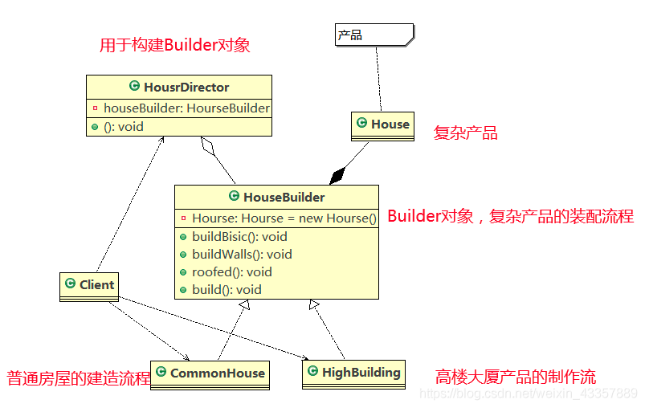

## 设计模式-建造者模式

#### 定义
是创建型模式之一，使用多个简单的对象创建一个复杂的对象，用于将一个复杂的构建与其表示分离，使得同样的构建过程可以创建不同的表示，然后通过一个Builder类创建最终对象。

#### 解决的问题
建造者模式主要用于解决软件系统中复杂对象的创建问题。例如复杂对象的创建通过各个部分的子对象用一定的算法构成，在需求变化时复杂对象面临大的改变，不利于系统的稳定，使用建造者将各个部分的算法包装起来，需求变化只需要将算法的顺序以及组合方式改变即可。

#### 角色
- Builder:创建一个复杂产品对象的抽象接口
- ConcreteBuilder：Builder接口的实现类，用于定义复杂产品的各个部分的装配流程
- Director：构造一个使用Builder接口的对象
- Product：表示被构造的复杂对象，ConcreteBuilder定义了该复杂对象的装配流程，而Product定义了该复杂对象的结构和内部表示

#### 场景应用
比如我们有两个系统，A系统在生成一个Json数据包后需要传给B系统，但是B系统在原始的数据中，需要构建一些它自有的属性（A系统中没有的），并且后续可能还会传给C系统，D系统，这时建造者模式就派上用场了。见代码
